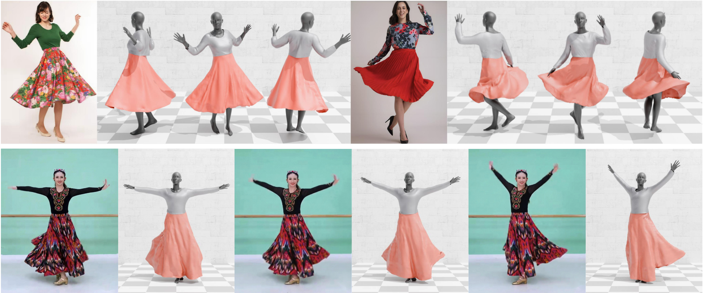

# Spatio-Temporal Garment Reconstruction Using Diffusion Mapping via Pattern Coordinates
<p align="center"></p>

This is the repo for [**Spatio-Temporal Garment Reconstruction Using Diffusion Mapping via Pattern Coordinates**](https://arxiv.org/pdf/2602.24043).

## Setup & Install

### The basic installation
  ```
  conda env create -f ./environment.yml
  conda activate dmap
  ```

### Install Pymesh
  - Following the [instruction](https://pymesh.readthedocs.io/en/latest/installation.html) to install Pymesh.

### Checkpoints
  - Download model checkpoints from [here](https://1drv.ms/f/c/d70f26d613e83858/IgAjzAeyZ9tLS4Ie81XJGUSiAQ_QnBTgXiL0qTcJyyZqAxs?e=4qN6FJ), and put it under the root of the repo `./checkpoints`.

## Data Preparation
  - Download the data from [here](https://1drv.ms/f/c/d70f26d613e83858/IgAgvbEwwotjRZlVtiUg9EL-AQPQCCY5rxzpNVAtGlKWOsA?e=rtkw2N), and put it under the root of the repo `./data`.

## Demo

Use the scripts under `./scripts` to recover 3D garment from the prepared images in `./data`. The codes use the data from `./data` as input, and save the results to `./fitting-results` by default.
```
cd scripts
```

### Option 1: Run the complete pipeline in one command
```
bash recover_all.sh
```
### Option 2: Run each step individually

Step 1: synthesize the normal for the invisible back.
```
python ./step1_back_normal_guide.py 
```

Step 2: predict the UV coordinates and depth from the normal.
```
python ./step2_uv_mapping_FB.py 
```

Step 3: fit ISP to the incomplete mask to recover the complete mask/rest garment.
```
python ./step3_isp_seq_one_mask.py  
```

Step 4: fit the diffusion prior to the incomplete UV positional maps to recover the complete UV maps/deformed garment.
```
python ./step4_uv_inpainting.py
```

Step 5: refine the recovered garment mesh using a set of observations and constraints (normal, mask, points, physical energy, temporal consistency, etc.).
```
python ./step5_post_opt.py
```
